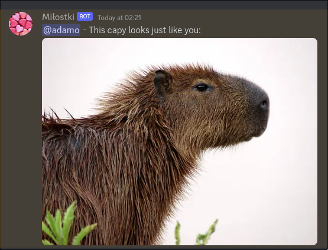
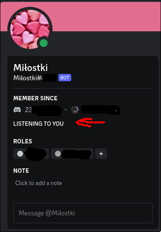

## Introduction

In the realm of digital connections, where distance is no longer a barrier to staying close, We embark on a journey to merge technology and emotion. In this article we create a Discord bot which leverages simple automation – every day at a specified time we will choose a random quote and a random image to send to someone special. This is a cute gift and can also help in learning and using asynchronous python.

## Plan

Let's deconstruct the steps needed to build this little guy:
- Set up the python environment (as always)
- Have the bot use a token to log in using the Discord API
- Set up a task to run periodically using a scheduler
- Have the bot send a message to a specific channel at a specific time

Let's walk through those steps one by one

## Setting up the environment

We have two choices here, global environment, or a virtual environment. Let's choose the latter:

```bash
python3 -m venv love_venv
source love_venv/bin/activate
pip3 install discord-py-interactions==5.5.1
```

Now we can use the `discord-py-interactions` to create the bot and interact with the Discord API. To do that we would need a token to log in as our bot to a server. Check out [this guide](https://discordpy.readthedocs.io/en/stable/discord.html) for obtaining that token and actually inviting the bot to your server! If you are not sure you got the right one, the token can look something like this: `OTk1MTU1NzcyMzYxMTQ2NDM4.[6 characters].[38 characters]`. We can use the following code to make sure the bot actually comes to life as expected:

```python
from interactions import Client, Intents, listen

bot = Client(intents=Intents.DEFAULT)

@listen()
async def on_ready() -> None:
    print(f"Yay, logged in as {bot.user}")

bot.start(token="MY_LITTLE_BOT_TOKEN_TAKEN_FROM_THE_DISCORD_WEBSITE_WHICH_IS_LONG_AND_INCONVENIENT_TO_POST_HERE")
```

which should print something like this:

```bash
❯ python3 main.py;
Yay, logged in as my-little-bot#8377
```

## Gathering and loading photos

Having the setup done, we can actually get to the cool part which is writing the actual logic. Let's gather some photos into a `photos` folder and create a file called `catchy_lines.txt` where we will store all your witty lines. The lines will randomly accompany a random picture from the wide range of *three* photos (you can place more ofc). Let's a look at our directory structure thus far:

```bash
❯ tree -I love_venv
.
├── catchy_lines.txt
├── main.py
└── photos
    ├── capy_one.jpg
    ├── capy_three.jpg
    └── capy_two.jpg

2 directories, 5 files
```

Let's create a global list of available filepaths and texts which will be populated by an async worker. Since this is a small little bot we won't worry about using global variables and concurrent access and suchlike.

```python
available_photos: list[str] = []
available_messages: list[str] = []
```

Let's create a task dedicated to refreshing those files every so often, that way if you place a new photo there, it can get auto-updated! This can be achieved using the `IntervalTrigger` which is set to trigger the task every set interval (in this case every 10 minutes). Reading a file in an async fashion can also be achieved with [aiofiles](https://github.com/Tinche/aiofiles) but unless your drive is from the 1900s you should be fine.

```python
from interactions import Client, Intents, IntervalTrigger, Task, listen

...

@Task.create(IntervalTrigger(minutes=10))
async def refresh_files():
    global available_messages, available_photos
    available_photos = os.listdir("photos")
    print(f"Available photos {available_photos}")
    with open("catchy_lines.txt", "r") as f:
        available_messages = f.readlines()
    print(f"Available messages {available_messages}")
```

This task needs to be instructed to run from somewhere, we can create an `on_startup` listener for starting those tasks.

```python
@listen()
async def on_startup():
    await refresh_files() # Refresh files when starting up
    refresh_files.start() # Instruct the scheduler to watch this task
```

Which gives us the following result:

```bash
❯ python3 main.py
Available photos ['capy_three.jpg', 'capy_two.jpg', 'capy_one.jpg']
Available messages ['This is you', 'This capy looks just like you', 'Message from the shadow government - capy here']
```

## Sending something, anything

**BUT HOW DO I SEND THIS?** I hear you cry, rightfully so. We can magically force our bot to send something to a specified channel using `GuildText.send`, but first let's ask ourselves a more important question - *How does the bot know WHERE to send the data?* You need two things:

- **ChannelID** - the guild channel where the bot will send the message
- **UserID** - the user to ping when a message is actually sent

Getting both of them is pretty easy and is described on the [Discord help page](https://support.discord.com/hc/en-us/articles/206346498-Where-can-I-find-my-User-Server-Message-ID). If you have **Developer Mode** enabled you can just right-click a channel and press `Copy Channel ID`. Let's place both of those as runtime globals:

```python
LOVER_ID = "190917205456584715"
CHANNEL_ID = "517485654502719091"
```

We managed an interval, but what about if we want to send the message at a set time, say 5:00? As you probably guessed, there is another trigger that we can use for this purpose - aptly called `TimeTrigger`. We use `fetch_channel` to get the guild that we want (the *text channel*) and use that channel to send a message. The `<@${LOVER_ID}>` is special syntax that can be used in normal Discord messages to tag someone - we don't really use it that way normally since there is a shorthand after typing `@`. *yes i triple checked lol*

```python
import os
from interactions import Client, GuildText, Intents, IntervalTrigger, Task, TimeTrigger, listen, to_snowflake
from random import choice

...

@Task.create(TimeTrigger(hour=5, utc=True))
async def send_message():
    print("Sending a cute message...")
    cute_photo = os.path.join(os.getcwd(), "photos", choice(available_photos))
    cute_message = choice(available_messages)
    chan = await bot.fetch_channel(to_snowflake(CHANNEL_ID))
    if isinstance(chan, GuildText):
        await chan.send(f"<@{LOVER_ID}> - {cute_message}:", files=cute_photo)
```

*NOTE: Remember to also add `send_message.start()` to our listener! The scheduler needs to know!*

## Checking if it works

Let's look at the complete code and make sure that we are on the same page:

```python
import os
from interactions import Client, GuildText, Intents, IntervalTrigger, Task, TimeTrigger, listen, to_snowflake
from random import choice
bot = Client(intents=Intents.DEFAULT)
LOVER_ID = "190917205456584715"
CHANNEL_ID = "517485654502719091"
@Task.create(IntervalTrigger(minutes=10))
async def refresh_files():
    global available_messages, available_photos
    available_photos = os.listdir("photos")
    print(f"Available photos {available_photos}")
    catchy_lines = open("catchy_lines.txt", "r")
    available_messages = [x.strip() for x in catchy_lines.readlines()]
    catchy_lines.close()
    print(f"Available messages {available_messages}")

@Task.create(TimeTrigger(hour=5, utc=True))
async def send_message():
    print("Sending a cute message...")
    cute_photo = os.path.join(os.getcwd(), "photos", choice(available_photos))
    cute_message = choice(available_messages)
    chan = await bot.fetch_channel(to_snowflake(CHANNEL_ID))
    if isinstance(chan, GuildText):
        await chan.send(f"<@{LOVER_ID}> - {cute_message}:", files=cute_photo)

@listen()
async def on_startup():
    await refresh_files()
    await send_message() # You can use this to check if the beast can send the message on startup
    refresh_files.start()
    send_message.start()

@listen()
async def on_ready() -> None:
    print(f"Yay, logged in as {bot.user}")

bot.start(token="MY_LITTLE_BOT_TOKEN_TAKEN_FROM_THE_DISCORD_WEBSITE_WHICH_IS_LONG_AND_INCONVENIENT_TO_POST_HERE")
```

A success would be to see the following happy little face:



Re-run the bot a couple of times to make sure the message/image get picked randomly correctly.

## Bonus: Activity listener

We can also configure the bot to have a specific activity active, which would look something like this:



We can use our trusty `IntervalTrigger` and a predetermined list of activities to spice up our bot. The bot has a `change_presence` method which allows it to dynamically change the activity in which the user is participating, only `GAME` `STREAMING` `LISTENING` `WATCHING` and `COMPETING` are usable by bots so pick your poison.

```python
available_activities: list[Activity] = [
    Activity("you", type=ActivityType.LISTENING),
    Activity("with your hair", type=ActivityType.PLAYING),
]

@Task.create(IntervalTrigger(minutes=30))
async def randomize_activity():
    """Randomize the activity of the bot so its not stale"""
    await bot.change_presence(activity=choice(available_activities))
```

*NOTE: I already told you, the scheduler is watching...* 

## Conclusion

In conclusion, we've embarked on a journey to create a small Discord bot that sends cute daily messages to a special person and by including the ability to change the bot's activity dynamically, we added a touch of variety to keep things interesting. **Feel free to customize and expand upon this, adding more features or personal touches. Bye!**
