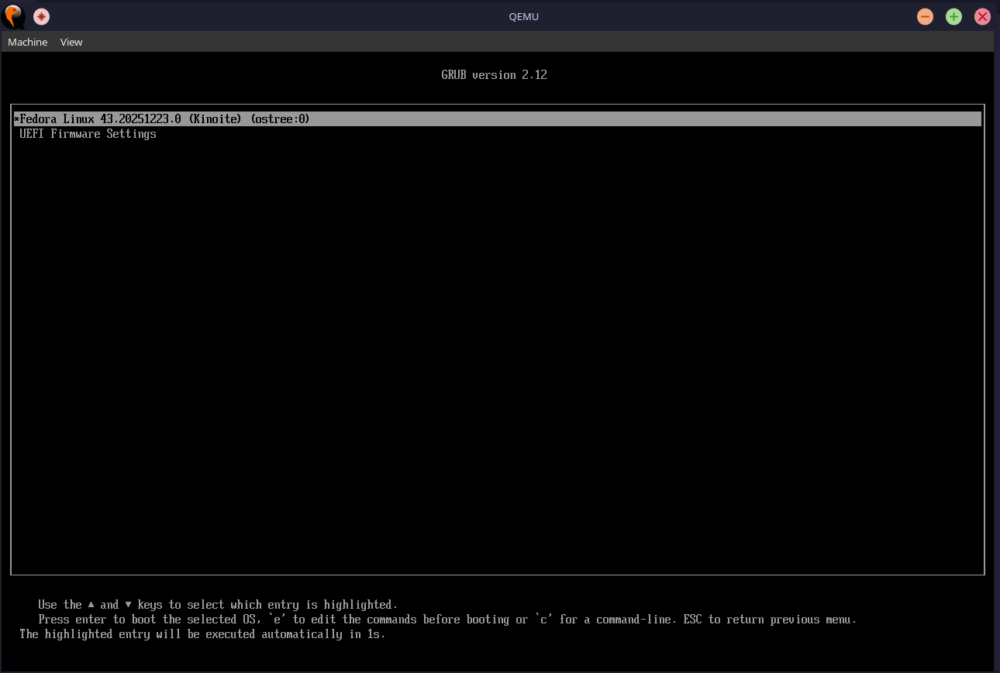
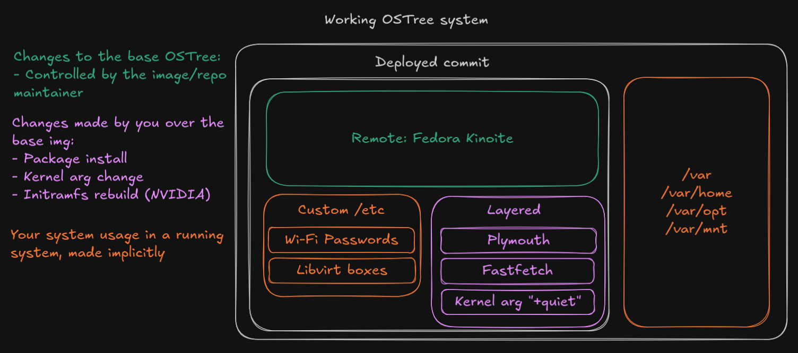
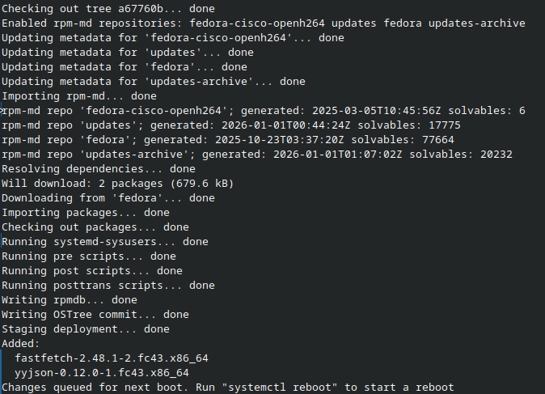
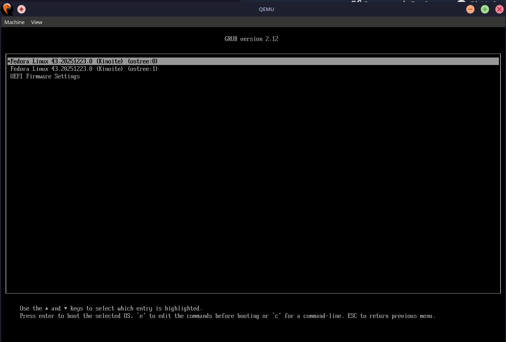
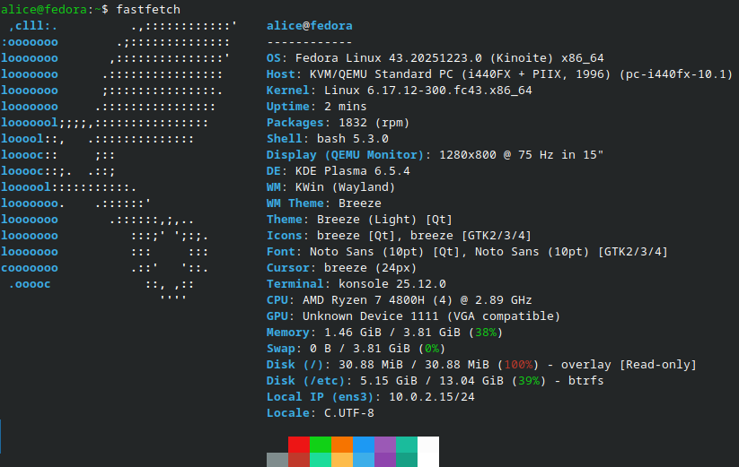

## Introduction

**Bootc is a technology allowing us to transport bootable "bare-metal" systems using OCI (or docker) container images. It allows for easy imperative OS configuration while maintaining a single source of truth - the container image**. You can basically use existing container infrastructure, tooling and knowledge to build your own immutable bare-metal systems. In this post I will demonstrate the overall structure of how this can be achieved, how I use it in my daily drivers and how you can get started with building desktop systems from a `Containerfile`.

If you're feeling adventurous let's create a VM right now for [Fedora Kinoite](https://fedoraproject.org/atomic-desktops/kinoite/), which is a variant of an [atomic desktop](https://fedoraproject.org/atomic-desktops/):

```bash
mkdir output
cat << EOF > config.toml
[[customizations.user]]
name = "alice"
password = "mypwd" # Remember that!
groups = ["wheel"]
EOF

# We have to pull it before
sudo podman pull quay.io/fedora/fedora-kinoite:43
sudo podman run --rm -it \
    --privileged \
    --security-opt label=type:unconfined_t \
    -v ./config.toml:/config.toml:ro \
    -v ./output:/output \
    -v /var/lib/containers/storage:/var/lib/containers/storage \
    quay.io/centos-bootc/bootc-image-builder:latest \
    --type qcow2 \
    --use-librepo=True \
    --rootfs btrfs \
    quay.io/fedora/fedora-kinoite:43
```

This basically takes in a container image (`quay.io/fedora/fedora-kinoite:43`) and installs it to a qcow2 disk image using [`bootc-image-builder`](https://github.com/osbuild/bootc-image-builder). Let's boot it up in qemu:

```bash
qemu-system-x86_64 \
    -M accel=kvm \
    -cpu host \
    -smp 4 \
    -m 4096 \
    -bios /usr/share/OVMF/OVMF_CODE.fd \
    -serial stdio \
    -snapshot output/qcow2/disk.qcow2
```

If you're brave (had ~15 minutes to spare for the building process) you can see some interesting parts even before the kernel is loaded into memory.



The GRUB entry summary shows some important baseline information like the fedora version and the build date but apart from that we can see someting about `ostree`. OSTree (operating system tree) is an underlying technology for immutable systems that has existed for more than 10 years and it's a core component of bootable containers. Let's dive a bit into how it handles system management.

## OSTree

You can think of OSTree like a **git repository for full operating system trees.** Even the authors of the software admit that it is largely [inspired by the git-like flow](https://ostreedev.github.io/ostree/repo/). Mutating the tree should seem very familiar if you ever touched git:

- `ostree --repo=repo init`
- `ostree --repo=repo commit --branch=foo myfile`
- `ostree --repo=repo refs`
- `ostree --repo=repo ls foo`
- `ostree --repo=repo checkout foo tree-checkout/`

**In this case commits are *hopefully* working filesystem trees ready to be "deployed" as a Linux OS.** An example commit can be a change like "Installed fastfetch", "Modified the default kernel args" or "Introduced plymouth in initramfs for cool loading screens". One major difference between your typical git workflow and the ostree world is that in git you typically commit changes on the client-side and push them to a specific remote, only then your peers can pull the code from the remote and work on them locally. **In an OSTree repository the commits are usually made server-side on the ostree remote and then replicated to individual clients.** In this architecture clients should ideally just be pulling static deltas from the remote (differences of files changed with an update) and overlaying their packages over it. Layered changes are local modifications that are made upon the base, for example modifying kernel arguments and installing packages just for you. One way to visualize a working OSTree system is as follows:



Once you create a deployment there's no easy way to apply it to the live system (the live-apply feature is not stable yet), so you have to reboot. Every significant state change in the system is recorded via commit and "confirmed" by booting into the newer deployment, **if a change breaks your system you can just select an earlier commit from the bootloader and have a working system 100% of the time.** This atomicity makes OSTree one of the more robust ways of deploying Linux machines. Let's **layer** a package inside of the VM to demonstrate:

```sh
sudo rpm-ostree install -y fastfetch
```



This took quite a while compared to traditional software installs, that is because this does much more than `dnf` or `apt` - the package was installed to a new commit, which then was used to create a new deployment. Do not reboot into the new deployment yet! Let's first examine the temporary in-between state of our system:

```sh
rpm-ostree status
```


Our OSTree state shows that there is a newer deployment from the most recent commit in our current branch, but it is yet to be booted into (indicated by the dot). We just layered a package over the base system of Fedora Kinoite, the base image was not affected by this change - the digest stays the same. Let's reboot and see the current GRUB state:



Now we have two deployed commits working simultaneously:

- 0 - The most recent commit (the one with fastfetch installed)
- 1 - Our original installation commit, which is the origin

We can boot into both of them and if we break our system while installing a package we can safely fallback to the previous commit. After booting into the most recent commit we can see that indeed, `fastfetch` can be accessed:



Keep in mind that ostree keeps only two deployments "alive" at the same time by default so if we install another package our initial commit would be deleted! We can also see some interesting parts by looking at the active kernel options:

```sh
alice@fedora:~$ cat /proc/cmdline 
BOOT_IMAGE=(hd0,gpt3)/boot/ostree/default-9e7937bd3d1c67cbf1895d39c4f80d16
467bf49430fb62feec95848eb622e05d/vmlinuz-6.17.12-300.fc43.x86_64 root=UUID
=f7b79370-cc1b-41d0-add3-e34396b98776 rootflags=subvol=/root rw boot=UUID=
cd39c236-0202-4c52-81e7-f17cfaf73185 console=tty0 console=ttyS0
ostree=/ostree/boot.0/default/9e7937bd3d1c67cbf1895d39c4f80d16467bf49430fb
62feec95848eb622e05d/0
```

The `ostree` kernel argument helps the system **find** the correct OSTree root to boot from. This is done by the `ostree-prepare-root` service running at the initramfs stage. Booting of an OSTree system basically looks something like this:

- *Pre-boot*: Some commit is made, deployment gets created along with a boot entry with `ostree-finalize-staged`
- Kernel + Initramfs + Kernel args get loaded in through GRUB along with the `ostree` parameter
- Initramfs runs `ostree-prepare-root` and finds the appropriate commit to boot from 
- It mounts the `/` filesystem from the specified deployment and does a root switch
- The init process (systemd) is started, you see "Welcome to Fedora"
- Success!

The only mutable system directories in this case are:

- `/etc` - partly managed, this is included in the commit and merged when new changes come, you can also edit files in `/etc` to make them unmanaged.
- `/var` - not managed by OSTree at all, apart from the fact that some convenience mounts are created to not make admins panic:
    - `/home` -> `/var/home`
    - `/mnt` -> `/var/mnt`
    - `/opt` -> `/var/opt`
    - *Some other popular data-centric dirs that are likely to be hard-coded in apps*

That's basically how we achieve the "run bare-metal devices from git-like repos" checkmark. But wait... 

## But what about the containers?

The revelation and important piece of information here is that **container images can be used as OSTree remotes.** Think of it like this:

- You have your OCI image at `docker.piaseczny.dev/machine/tygrys20:latest`. This docker image is the `ostree/container/image/docker_3A__2F__2F_docker_2E_piaseczny_2E_dev/machine/tygrys20_3A_latest` branch of your ostree repo (this is the actual name of the branch btw, I don't know why everything is ASCII hex subsituted).
- The unpacked image contents from the OCI image are the "base" files that go in the commit. This gets packed in with your `layered` apps (like we layered fastfetch on top of the base kinoite image) and combined with your `/etc` to create the actual commit for your running system.
- *You use the system for some time*
- The base image is updated, the rpm-ostree runtime pulls the OCI image, unpacks it into a directory and makes another commit in the OSTree branch. Your system gets a new deployment with content right from the image and you get all the immutability and atomicity benefits, profit!

This workflow addresses one common misconception when it comes to bootc - **there is no runtime!**, the container images are unpacked into an OSTree repo - there is [no cgroups, no namespaces and no capabilties](/posts/docker-psm/). Importantly, those base images for your system can actually be created using container tooling you already know, which makes this already powerful method of managing systems supercharged. This is a deeper level of customization that the default, so let's pull up our architecture diagram again.


When we installed fastfetch, we modified the purple part, **now we are going to take ownership of the remote and replace the green part** of our system. Let's use container tooling to create a completely custom OS image that is tailored specifically to your needs. 


### Your first customized Fedora Kinoite image

Let's create an OCI image based on the already available Fedora Kinoite one. We are going to be basing on the exact image that we pulled earlier to not have to re-download the base image. Run `rpm-ostree status` again and take note of the `Digest` part. In my case this is `sha256:18a5bee9b6163a51418401c60330e47ed2b43347970faa3943e27a17be13f06f`. Create a `Containerfile`:

```Dockerfile
FROM quay.io/fedora/fedora-kinoite:43@sha256:18a5bee9b6163a51418401c60330e47ed2b43347970faa3943e27a17be13f06f
# You can also run quay.io/fedora/fedora-kinoite:43 and download a newer image 

# Add tailscale to the mix
RUN dnf config-manager addrepo --from-repofile=https://pkgs.tailscale.com/stable/fedora/tailscale.repo
RUN dnf install -y tailscale
RUN systemctl enable tailscaled

# Look for common issues, like stray files in /var
RUN bootc container lint
```

Note that `dnf` while does not work in OSTree-based systems yet, it is actually available and **working inside of the container building process** because /usr is not mounted read-only like in real deployments. We also lint this image using bootc to look for common mistakes while creating bootable container images. Build this image using:

```sh
sudo podman build . --tag docker.io/typicalam/my-demo-kinoite:43
```

Now to actually to actually **rebase** our running VM to this system we need to deploy this image to a container registry somehow. In my example I will use the `docker.io` container registry:

```sh
# Use the username and a PAT from docker to do so
sudo podman login docker.io
sudo podman push docker.io/typicalam/my-demo-kinoite:43
```

Once this image is uploaded we can use this in our fedora atomic system.


**Note:** If you don't want to push your own image to docker you can use the container image that I just showed. The built version of this is still available at `docker.io/typicalam/my-demo-kinoite:43`.


Since a new upstream image is available we can rebase our OSTree installation to it: 

```sh
sudo rpm-ostree rebase ostree-unverified-registry:docker.io/typicalam/my-demo-kinoite:43
```

Since it uses OCI layers under the hood we should see that most of the layers are acatually reused from the original Kinoite image! The only ones that are pulled are the three RUN instructions for tailscale. The lint instruction does not generate any layers/files. In my case it did actually pull the whole underlying kinoite image but I think it's mostly some cache bust thingy.

In the end we can see the summary of the changes between the newly deployed rebased system and our current one. Our system will now query the `docker.io/typicalam/my-demo-kinoite:43` image on upgrades. Should we upgrade the image in the registry `rpm-ostree upgrade` will upgrade both the base image and any custom layered packages on top.

```sh
rpm-ostree status
```

```sh
alice@fedora:~$ rpm-ostree status
State: idle
Deployments:
  ostree-unverified-registry:docker.io/typicalam/my-demo-kinoite:43
                   Digest: sha256:96ffed88fe4f604f26ed65901d816fc1eb2c66d75de08e95e59fce06117f22ba
                  Version: 43.20251223.0 (2026-01-01T18:46:19Z)
                     Diff: 1 added
          LayeredPackages: fastfetch

● ostree-unverified-registry:quay.io/fedora/fedora-kinoite:43
                   Digest: sha256:18a5bee9b6163a51418401c60330e47ed2b43347970faa3943e27a17be13f06f
                  Version: 43.20251223.0 (2025-12-23T00:41:35Z)
          LayeredPackages: fastfetch

  ostree-unverified-registry:quay.io/fedora/fedora-kinoite:43
                   Digest: sha256:18a5bee9b6163a51418401c60330e47ed2b43347970faa3943e27a17be13f06f
                  Version: 43.20251223.0 (2025-12-23T00:41:35Z)
```

Once rebooted you will notice that tailscale is available! In our case we better rollback (at the bootloader stage) to our `quay.io/fedora/fedora-kinoite:43` because we have not set up a way for the base image to be updated. Of course we can just spam `rpm-ostree upgrade` and pretend its a `dnf update -y` all day but that does not scale well when you have multiple machines and you want better state replication.

One way to tackle that is to **use CI to build the bootc containers** and do it in (almost) the standard way. Just look at the Github CI configuration for [**my config**](https://github.com/TypicalAM/tygrys20/blob/main/.github/workflows/container-image.yml) and see for yourself how easy it is to deploy such systems, the only weird part is that sometimes those images are large in size so I delete a couple of unimportant Github runner tools. **Otherwise the process of creating your own derived OS is the same as building your production docker images.**

## Community aspect

The way I actually got to know about this project was through [Bazzite](https://bazzite.gg/) which is a Steam OS alternative for steam deck that works out of the box. It is lead by the Universal Blue team, which boasts about its efforts building around rpm-ostree and bootc as trying to achieve "the reliability of a Chromebook, but with the flexibility and power of a traditional Linux desktop." (A bold claim indeed). Those people are basically the front-runners when it comes to consumer-facing adoption of the technology in the open. Unfortunately only rpm-based systems like CentOS, RHEL and Fedora get first-class support from the technology since rpm-ostree and bootc came from Red Hat.

# Conclusions

Bootc and OSTree are technologies that allow you to redistribute OSTree commits as OCI container images and deploying those commits as working OS trees with atomic upgrades. Usage of OCI images allows us to leverage existing infrastructure and tooling around containers to provide additional benefits like easy security scanning.

## Good things

Things that are cool:

- Rollbacks, you always have a working system state
- Multiple machines have the same working system and differences can be easily queried
- If I break my machine I can regenerate it in less than an hour (with data!)
- Backups are much easier (btrfs snapshot on `/var`, everything else is in the image)

## Bad things

Like everything in engineering this is a tradeoff. Here are some things that I had problems with while migrating my personal machines:

- You have to restart on most updates
- No ESP-only booting - I hacked my way around with rEFInd, but GRUB is always there, plotting...
- You have to figure out a way to do dev environments for fast tool installs, I now use `distrobox` and I'm glad this problem presented itself.

If you also build your own OS images (take control of the remote):

- Build times for containers are quite long and caching is quite hard - my whole CI runs in 10-15 mins and is network-bound
- Iteration time of machines is quite slow, but once you get it right you get it right

### Less reading, more doing

Getting started with OSTree systems:

- Universal blue images are a great place to start - https://universal-blue.org/
- Fedora Atomic desktops page

If you want to build your own OS images: 

- I personally used [kde-bootc](https://github.com/sigulete/kde-bootc) as a basis for creating my config
- You can also look at my tygrys20 configuration and the [Containerfile](https://github.com/TypicalAM/tygrys20/blob/main/Containerfile) that I use for my real, running systems
- The kind people of Universal Blue have more of a high-level template which you can see on [ublue-os/image-template](https://github.com/ublue-os/image-template).

Hope you learned something interesting today! *Photo by Pixabay: https://www.pexels.com/photo/grayscale-photography-of-chain-220237/*
