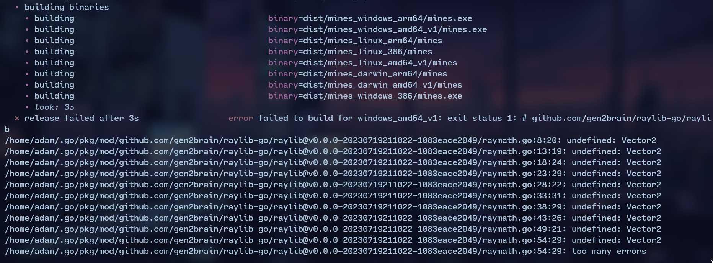
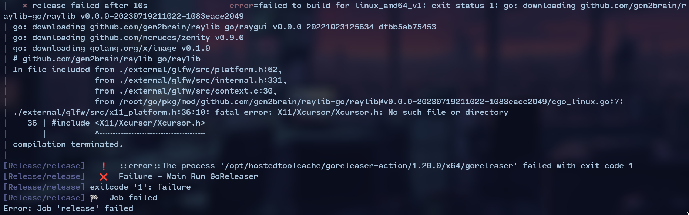
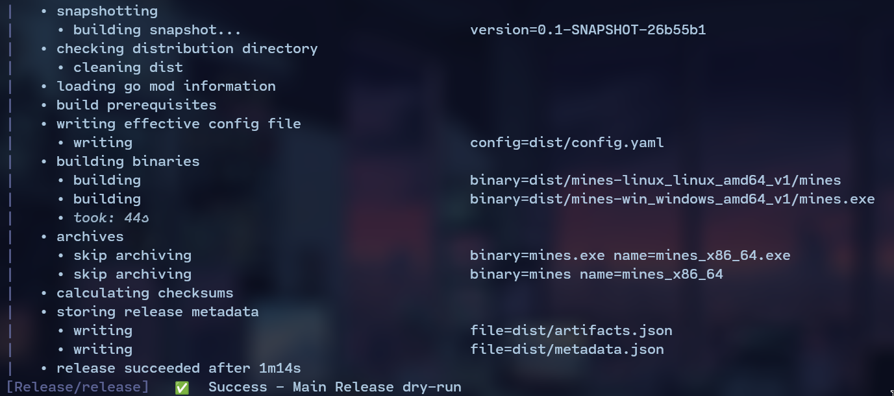

## Introduction

I recently revisted my [mines](github.com/TypicalAM/mines) project that uses [raylib-go](https://github.com/gen2brain/raylib-go/) - a wrapper for an amazing graphics library called [raylib](https://www.raylib.com/). After doing some cleaning up and laughing at some of my old code (*duh*) I thought it would be a great idea to make a Github release to allow others to download the app. For streamlined releases, I turned to my preferred tool, [Goreleaser](https://github.com/goreleaser/goreleaser).

## The Challenge

After setting up a basic `.goreleaser.yaml` file in the root of the repository and running `goreleaser release --clean --snapshot` I noticed that we get some weird errors which look like `C` import errors.



This makes sense, `raylib` is a `C` library and `raylib-go` is just a wrapper using the `C` & `Go` interoperability to achieve smooth integration, but this poses a problem for our automatic releasing environment. The [raylib-go README](https://github.com/gen2brain/raylib-go/blob/master/README.md) says that if we want to build our binary for windows not only do we need the base library requirements, but also the mingw windows compiler toolchain. Let's try to do that first on our own, before automating it. After installing the `mingw` compiler we need to tell the Go compiler that our target is windows and also we want to enable `CGO` (the interoperability layer) and what compiler we want to use:

```bash
GOOS=windows GOARCH=amd64 CGO_ENABLED=1 CC=x86_64-w64-mingw32-gcc go build -o mines.exe main.go
```

This actually works, and if we **really** want to, we can just make our own release locally and upload it to Github right from our computer, but our goal is to avoid manual intervention and perform the release process using Goreleaser. How can we transition these steps into a Goreleaser configuration?

## Local Goreleaser Usage

Let's replicate the above command using goreleaser! For every build, we must set the `CGO_ENABLED=1` environment variable. Since different compilers are needed for Windows and Linux, we define two builds, each with their own `CC` and `CXX` compilers:

```yaml
env:
  - CGO_ENABLED=1

builds:
  - id: mines-win
    goos:
      - windows
    goarch:
      - amd64
    env:
      - CC=x86_64-w64-mingw32-gcc
      - CXX=x86_64-w64-mingw32-g++

  - id: mines-linux
    goos:
      - linux
    goarch:
      - amd64
    env:
      - CC=x86_64-linux-gnu-gcc
      - CXX=x86_64-linux-gnu-g++

archives:
  - format: binary
    name_template: >-
      mines_
      {{- if eq .Arch "amd64" }}x86_64
      {{- else if eq .Arch "386" }}i386
      {{- else }}{{ .Arch }}{{ end }}
```

Now if everything went as expected and we have all the dependencies, the release will succeeed! But only on our local machine, where we have the `raylib` dependencies and the windows compiler toolchain. Let's try moving to the cloud!

## Github workflow

Let's start with this basic workflow. Let's create a file in `.github/workflows/release.yml`.

```yaml
name: Release

on:
  push:
    tags:
      - '*'
jobs:
  release:
    runs-on: ubuntu-latest
    steps:
      - name: Checkout
        uses: actions/checkout@v3
      - name: Setup go
        uses: actions/setup-go@v3
        with:
          go-version: '1.20.0'
      - name: Run GoReleaser
        uses: goreleaser/goreleaser-action@v4
        with:
          distribution: goreleaser
          version: latest
          args: release --clean --snapshot
        env:
          GITHUB_TOKEN: ${{ secrets.GITHUB_TOKEN }}
```

Now let's this Github action locally with [act](https://github.com/nektos/act). We will find ourselves with this view:



The `goreleaser-action` lacks have the dependencies that we talked about earlier. How can we fix that? We need a system that:

- Supports package releases
- Contains the necessary Windows compiler toolchain (or macOS counterpart)
- Includes the `raylib` dependencies

It just so happens that goreleaser has a tool called [goreleaser-cross](https://github.com/goreleaser/goreleaser-cross). It is a docker image which has all the cross-compiling dependencies already built in (and has goreleaser obviously). 

## Goreleaser-cross

We need to create an environment in which our action can run the `goreleaser-cross` docker image and add the raylib dependencies before doing that. To add the raylib dependencies create a `Dockerfile` in the root of the project. 

```Dockerfile
FROM ghcr.io/goreleaser/goreleaser-cross:v1.20.0 # Use goreleaser-cross as the base image

RUN apt-get update -y # Update
RUN apt-get install -y libgl1-mesa-dev libxi-dev libxcursor-dev libxrandr-dev libxinerama-dev # Install raylib deps
```

Also, create a `Makefile` to be able to build and run the images easily:

```Makefile
PACKAGE_NAME := github.com/TypicalAM/mines

.PHONY: release-dry-run
release-dry-run:
	@docker build -t mines .
	@docker run \
		--rm \
		-e CGO_ENABLED=1 \
		-v /var/run/docker.sock:/var/run/docker.sock \
		-v `pwd`:/go/src/$(PACKAGE_NAME) \
		-w /go/src/$(PACKAGE_NAME) \
		mines \
	  --clean --snapshot

.PHONY: release
release:
	@if [ ! -f ".env-release" ]; then\
		echo ".env-release is required for release";\
		exit 1;\
	fi
	@docker build -t mines .
	@docker run \
		--rm \
		-e CGO_ENABLED=1 \
		--env-file .env-release \
		-v /var/run/docker.sock:/var/run/docker.sock \
		-v `pwd`:/go/src/$(PACKAGE_NAME) \
		-w /go/src/$(PACKAGE_NAME) \
		mines \
	  release --clean
```

Now run `make release-dry-run` to verify that the docker image works and the release compiles as expected. Let's also modify the github workflow to use our `Makefile`. Remember that the `Makefile` uses a `.env-release` file to infer the Github release token, we need to provide that for the official release:

```yaml
name: Release

on:
  push:
    tags:
      - '*'
jobs:
  release:
    runs-on: ubuntu-latest
    steps:
      - name: Checkout
        uses: actions/checkout@v3
      - name: Setup go
        uses: actions/setup-go@v3
        with:
          go-version: '1.20.0'
      - name: Release dry-run
        run: make release-dry-run
      - name: Create dotenv for release
        run: echo 'GITHUB_TOKEN=${{ secrets.GITHUB_TOKEN }}' > .env-release
      - name: Release publish
        run: make release
```

Let's test for the last time using `act`. We cannot really check the final release, because we don't have a Github release token ready. **Also remember to create a secret on Github for the final release!**



After a challenging journey, we succeeded. The beauty of this solution lies in its adaptability – **you can readily apply a similar approach to various scenarios you encounter**. All the files discussed in this article can be found in my [mines](https://github.com/TypicalAM/mines) repository on GitHub. If you found this post helpful, consider giving it a star. Best wishes on your projects!
