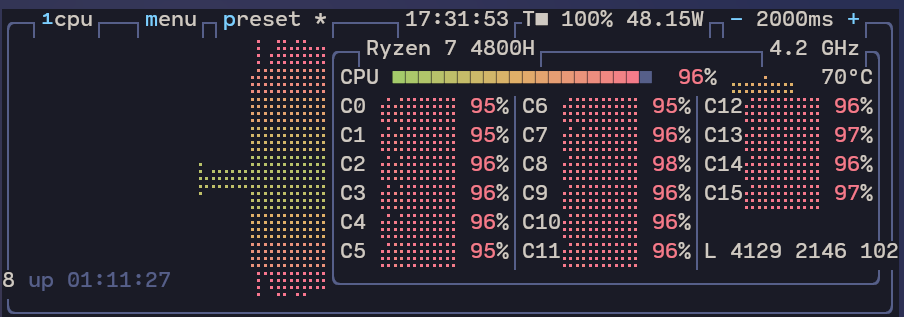
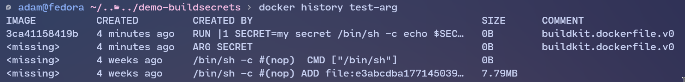
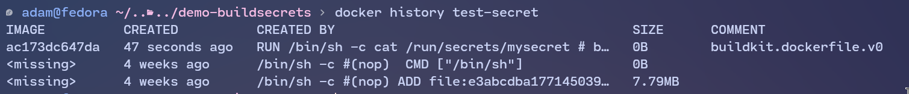

## Introduction

Some time [about a week ago](https://x.com/samistherealest/status/1740722664384401692) I had the pleasure of being a speaker at [Poznań Security Meetup 3](https://www.meetup.com/poznan-security-meetup/events/301269323/) and **talking about docker security to around a 100 people!** Since I'm sure I glossed over some importants detail let me use this post fill in any gaps or to bring you up to speed in if you weren't present! **If you want to see the presentation you can download it [here](https://opensecurity.pl/wp-content/uploads/2024/06/hardening-dockera.pdf).** Anwyays, this is me:


***NOTE:** On the talk I mentioned the difference between LXC and docker containers and did an intro to how the docker ecosystem works. While using the term "containers/docker containers" in this blog post I mean [OCI containers](https://opencontainers.org/).*

## Why containers work?

You may have heard this magical online passage:

> I'd just like to interject for a moment. What you're refering to as Linux, is in fact, GNU/Linux, or as I've recently taken to calling it, GNU plus Linux. Linux is not an operating system unto itself, but rather another free component of a fully functioning GNU system made useful by the GNU corelibs, shell utilities and vital system components comprising a full OS as defined by POSIX. ~ Not Richard Stallman

and in our case it has tons of educational merit. You see containers work wonders because of the fact that they share the linux kernel with the host operating system. **This makes containers fast becuase they don't need to emulate hardware devices.** Since we are running on the same kernel, most of the security features that we're going to be dealing with are implemented and exposed **by the kernel itself.** Because of the lack of emulation most of the things we are going to be talking about are in relation to the art of "escaping" to the host system.

## How the docker socket works? 

The `docker` command is just a CLI to access the docker daemon, the daemon manages things like networking, volumes and images. They communicate using REST via a [socket file](https://askubuntu.com/questions/372725/what-are-socket-files) located at `/var/run/docker.sock` - we can check that using `curl` on the host machine. Running `curl --unix-socket /var/run/docker.sock http://localhost/images/json` should get us the available images, so let's see about that...

```sh
adam@host ~ > curl --unix-socket /var/run/docker.sock http://localhost/images/json
curl: (7) Failed to connect to localhost port 80 after 0 ms: Couldn't connect to server
```

Couldn't connect? Maybe something with the file?

```sh
adam@host ~ > ls -l /var/run/docker.sock
srw-rw----. 1 root docker 0 Jun 22 11:21 /var/run/docker.sock
adam@host ~ > groups
adam wheel pkg-build libvirt
```

The socket file is owned by the group `docker`! That's why you need the `docker` group to spawn containers when not using `sudo`. Now running that command again and passing it to [jq](https://jqlang.github.io/jq/).

```sh
adam@host ~ > curl --silent --unix-socket /var/run/docker.sock http://localhost/images/json | jq           
[
  {
    "Containers": -1,
    "Created": 1719404777,
    "Id": "sha256:ac173dc647dad829d7b9e8530779ad8b2bf66c45768c8b2963e03e8a9547af91",
    "Labels": null,
    "ParentId": "",
    "RepoDigests": [],
    "RepoTags": [
      "test-secret:latest"
    ],
    "SharedSize": -1,
    "Size": 7794716
  },
...
```

We can see that this container - `test-secret:latest` corresponds to the output of `docker image ls`:

```sh
adam@host ~ > docker image ls                                            
REPOSITORY                               TAG               IMAGE ID       CREATED             SIZE
test-secret                              latest            ac173dc647da   About an hour ago   7.79MB
test-arg                                 latest            3ca41158419b   2 hours ago         7.79MB
...
```

Basically, the docker socket is the gateway of communcating between the frontend and the backend of the docker runtime. *Later, we will discuss the implications of centralizing communication like that.*

## Namespaces

I said that containers are using the same kernel as the host system, let's check that using a simple test. Run: 

```sh
adam@host ~ > docker run --interactive --tty --rm alpine:3.20.0 sleep 25 &
[1] 163159
adam@host ~ > ps u -u root | grep "sleep 25"
root      163255  0.2  0.0   1612   640 pts/0    Ss+  15:07   0:00 sleep 25
```

Let's break this down: `docker run` creates a container with the tag `alpine:3.20.0`. The flag `--interactive` makes the container interactive, `--tty` allocates a pseudo-tty and `--rm` removes the container after the shell has exited. We execute `sleep 25` and as we can see the `sleep 25` **inside the container is visible from the host machine as being run from the `root` user.** If you check the inverse (i.e. run a `sleep 25` on the host machine and `ps aux` on the container) you will notice that the container cannot see the host processes. That is because of a magical thing called **kernel namespaces**. As per `man namespaces`:

> A namespace wraps a global system resource in an abstraction that makes it appear to the processes within the namespace that they have their own isolated instance of the global resource. Changes to the global resource are visible to other processes that are members of the namespace, but are invisible to other processes.

Here are the available namespace types: 
```
   Namespace types
       Namespace Page                  Isolates
       Cgroup    cgroup_namespaces(7)  Cgroup root directory
       IPC       ipc_namespaces(7)     System V IPC, POSIX  message
                                       queues
       Network   network_namespaces(7) Network   devices,   stacks,
                                       ports, etc.
       Mount     mount_namespaces(7)   Mount points
       PID       pid_namespaces(7)     Process IDs
       Time      time_namespaces(7)    Boot and monotonic clocks
       User      user_namespaces(7)    User and group IDs
       UTS       uts_namespaces(7)     Hostname and NIS domain name
```

That's why [`--network=host`](https://stackoverflow.com/questions/64142811/docker-container-has-access-to-internet-but-not-the-local-network) makes LAN devices visible to a container - the container gets added to the host's `Network` namespace. Let's try the process example again but this time, adding the container to the host's `PID` namespace with `--pid=host`:

```sh
adam@host ~ > sleep 25 &
[1] 232866
adam@host ~ > docker run --interactive --tty --rm --pid=host alpine:3.20.0 ps aux | grep "sleep 25"
232866 1000      0:00 sleep 25
adam@host ~ > id                                                                                   
uid=1000(adam) gid=1000(adam) groups=1000(adam),10(wheel),971(pkg-build),974(docker),983(libvirt)
```

**Since we added the container to the host's namespace, we can see the `sleep 25` that was created on the host!** As we can see the process seen by the container has the ID of the owner set to `1000`, which is the ID of the `adam` user. Namespaces basically limit what you **can see as a container**, let's explore how to limit what you **can do.**

## Capabilities

The manual page for `capabilities` says the following:

> Starting  with  Linux 2.2, Linux divides the privileges traditionally associated with superuser into distinct units, known as capabilities, which can be independently enabled and disabled.

Capabilities basically break down the power of root into different parts and allow the **root on the container to not be equal to host root**. There are many available ones, let's just mention the ones [given to containers by default](https://github.com/moby/moby/blob/master/oci/caps/defaults.go#L6-L19): 

```go
func DefaultCapabilities() []string {
    return []string{
        "CAP_CHOWN",             // Allows changing the owner of files.
        "CAP_DAC_OVERRIDE",      // Bypasses file read, write, and execute permission checks.
        "CAP_FSETID",            // Allows setting the file system User ID (UID) and Group ID (GID) bits.
        "CAP_FOWNER",            // Allows bypassing permission checks (file owner)
        "CAP_MKNOD",             // Allows the creation of special files using the mknod system call.
        "CAP_NET_RAW",           // Allows the use of RAW and PACKET sockets.
        "CAP_SETGID",            // Allows setting the GID (Group ID) of a process.
        "CAP_SETUID",            // Allows setting the UID (User ID) of a process.
        "CAP_SETFCAP",           // Allows setting file capabilities.
        "CAP_SETPCAP",           // Allows modifying process capabilities.
        "CAP_NET_BIND_SERVICE",  // Allows binding to network ports below 1024.
        "CAP_SYS_CHROOT",        // Allows the use of chroot() system call
        "CAP_KILL",              // Allows sending signals to processes
        "CAP_AUDIT_WRITE",       // Allows writing to the audit logs.
    }
}
```

There are also some dangerous ones not given by default like:

- `CAP_SYS_ADMIN` - Allows the user to perform a **LOT** of system administration operations. Basically allows to gain other priviledges.
- `CAP_SYS_BOOT` - Allows to use `reboot` and `kexec_load`. You can just build a custom kernel with a malicious kernel module and load it into the host system.

Why am I mentioning this? Because some people advocate for using the `--privildged` flag in some "i don't want permission issues" cases. It is really important to understand that **it gives all the capabiltiies to the container, making it essentially root on host.** You can drop capabilities for containers using `--cap-drop=ALL` and add them using for example `--cap-add=CAP_NET_ADMIN`. Let's check if that works using our trusty `alpine:3.20.0`:

```sh
adam@host ~ > docker run --interactive --tty --rm --cap-drop=ALL --cap-add=CAP_NET_ADMIN alpine:3.20.0 sh
/ # apk add libcap
fetch https://dl-cdn.alpinelinux.org/alpine/v3.20/main/x86_64/APKINDEX.tar.gz
fetch https://dl-cdn.alpinelinux.org/alpine/v3.20/community/x86_64/APKINDEX.tar.gz
...
OK: 8 MiB in 19 packages
/ # capsh --print # print available capabilities
Current: cap_net_admin=ep
Bounding set =cap_net_admin
Ambient set =
Current IAB: !cap_chown,!cap_dac_override,!cap_dac_read_search,!cap_fowner,!cap_fsetid,!cap_kill,!cap_setgid,!cap_setuid,!cap_setpcap,!cap_linux_immutable,!cap_net_bind_service,!cap_net_broadcast,!cap_net_raw,!cap_ipc_lock,!cap_ipc_owner,!cap_sys_module,!cap_sys_rawio,!cap_sys_chroot,!cap_sys_ptrace,!cap_sys_pacct,!cap_sys_admin,!cap_sys_boot,!cap_sys_nice,!cap_sys_resource,!cap_sys_time,!cap_sys_tty_config,!cap_mknod,!cap_lease,!cap_audit_write,!cap_audit_control,!cap_setfcap,!cap_mac_override,!cap_mac_admin,!cap_syslog,!cap_wake_alarm,!cap_block_suspend,!cap_audit_read,!cap_perfmon,!cap_bpf,!cap_checkpoint_restore
```

As we can see we successfully dropped all the capabilties except for `CAP_NET_ADMIN`. **You should examine your docker containers and drop all the capabilities that they do not need to limit the potential damage.**

## Docker socket exposure

Another thing that is very dangerous but seen quite often is **exposing `/var/run/docker.sock` to containers**. Why would somebody do this? Software like [traefik](https://doc.traefik.io/traefik/) in my [homelab](https://blog.piaseczny.dev/projects/wydra9/) uses the information received by the socket to load balance a route based on how many containers are available. **Exposisng the docker socket is extremely dangerous and stupid and you shouldn't do that!** It may seem innocent at first but let's do a quick demo to see what you can do once you detect something like this:

```sh
adam@host ~ > docker run --interactive --tty --rm --volume "/var/run/docker.sock:/var/run/docker.sock" alpine:3.20.0 sh
/ # apk add docker
fetch https://dl-cdn.alpinelinux.org/alpine/v3.20/main/x86_64/APKINDEX.tar.gz
fetch https://dl-cdn.alpinelinux.org/alpine/v3.20/community/x86_64/APKINDEX.tar.gz
...
OK: 280 MiB in 27 packages
/ # docker run --interactive --tty --volume "/:/psm" ubuntu:24.04 sh
# cat /psm/etc/hostname
host
```

As you can see, the **container docker client uses the host socket to mount the host root filesystem on `/psm`** - We verify this by checking the hostname of the host system. We could also just spin up a `--priviledged` container and have basically full control over the host system. *Try not to expose the docker socket for no reason.*

### But what if I need to communicate?

You can filter kernel calls at host OS level with mechanisms like SELinux, to only allow an identified set of actions for the container client (or the "socket exposer" process). **You can also (with less config) expose the Docker socket over TCP or SSH, instead of the the socket file.** It allows different implementation levels of the AAA (Authentication, Authorization, Accounting) concepts, depending on your security assessment. For more info refer to [protecting the daemon socket](https://docs.docker.com/engine/security/protect-access/).

## Limiting container resources with control groups

Now imagine that someone breaks into your container and runs this magical line: `:(){ :|:& };:`. If you sometimes use linux you might get what that means - it's a [fork bomb](https://en.wikipedia.org/wiki/Fork_bomb) that makes the CPU go boom boom with infinitely spawning processes.

Fortunately, Docker containers provide a layer of protection against such attacks through the use of control groups, or `cgroups`. They are a kernel feature that allows you to allocate resources such as CPU, memory, and I/O bandwidth among user-defined groups of tasks (in this case, containers). The different resources that can be controlled are listed in `man cgroups`. (you just gotta love `man`, man). Let's set off a forkbomb in alpine:

```sh
adam@host ~ > docker run --interactive --tty --rm alpine:3.20.0 sh
/ # bomb(){ bomb|bomb& };bomb
/ #
[1]+  Done                       bomb | bomb
```

This is output of my host's `btop`, as you can see I am *ripping the threads*:



If you're lucky you will be able to kill the container via `docker kill`. How to remedy this? Let's look into forkbombing again but this time with `--memory` and `--cpus` flags:

```sh
adam@host ~ > docker run --interactive --tty --rm --memory 256m --cpus 4 alpine:3.20.0 sh
/ # bomb(){ bomb|bomb& };bomb
/ #
[1]+  Done                       bomb | bomb
```

the output is the same, but we put a lock on how many resources the container can use, **effectively making DDoS attacks much harder to execute**. We can also use the `--restart on-failure:5` policy to disallow attacks abusing the restart on-failure mechanic (and maybe set up alerts if we fail to start an abysmal 5 times).

## Build time secrets

So far we mostly talked about hardening the runtime and how to bend the daemon to our will - let's now talk about less administrator-like actions. Our fake company wants to build an image and push it to the `dockerhub` but all our files are hidden behind an `rsync`-enabled server. How do we get those files while building the image? We need a key, and a way to use it while building, but in a way so it will not appear in the built image. A common solution is to use [build arguments](https://docs.docker.com/build/guide/build-args/) - create a `Dockerfile.build-args` file with the following contents:

```docker
FROM alpine:3.20.0
ARG SECRET
RUN echo $SECRET
```

Build it using `docker build --file Dockerfile.build-args --tag test-arg --build-arg SECRET="my secret" .` The secret was hidden in plaintext in the build layers! Don't believe me? Let's use `docker history test-arg`:



We can remedy this using an OCI image builder feature. Let's create a file called `SECRET` with the contents `hello world!` and create the file `Dockerfile.secret`:

```docker
FROM alpine:3.20.0
RUN --mount=type=secret,id=mysecret cat /run/secrets/mysecret
```

We build it using the special secret syntax, we need to supply the id of the secret and also the name of the file containing the secret. It would be advised that file has special permissions, **so that us mortals cannot read it easily**. Build using `docker build --no-cache --secret id=mysecret,src=$PWD/SECRET --file Dockerfile.secret --tag test-secret .` Checking out `docker history test-secret --no-trunc`:



We can also use the special `RUN --mount` instruction with `ssh` keys to allow for secure remote data fetching at build time! Check out [this docker page](https://docs.docker.com/build/building/secrets) for more info!

## Host OS security

Since the kernel is shared with the host OS, we can allow ourselves to have a very "light" host runtime environment. **This is your call to just install `gentoo` and have some fun setting up the worst production server ever!** But seriously, if you're planning on self-hosting container infrastructure it would be very wise to have a minimal base OS, and harden it with things like SELinux ([here](https://opensource.com/article/20/11/selinux-containers)). You can also use [AppArmor](https://docs.docker.com/engine/security/apparmor/) or modify the built-in [seccomp profiles](https://docs.docker.com/engine/security/seccomp/).

## Summary

Containers are basically just isolated processes, so we need to make sure of two things:

1) **Conatiner cannot escape to the host**
2) **Attacker cannot affect host "quality of life" like CPU and memory**

What should I do again? I hear you say - *uncle Adam has you covered*:

- **Drop all non-needed capabilities**
- **Harden the host OS - use SELinux or similar**
- **Limit chance of escalation using the `USER` directive and maybe [namespace remapping](https://docs.docker.com/engine/security/userns-remap/)**
- **Limit resources of your containers to prevent resource depletion attacks (try not to forkbomb yourself)**

You should probably also [scan your containers](https://www.docker.com/blog/automating-your-containers-security-scanning/)

## Sources

What I used to prepare for the talk:

- [Docker Engine Security](https://docs.docker.com/engine/security/)
- [MITRE ATT&CK® Matrix for Containers](https://attack.mitre.org/matrices/enterprise/containers/)
- [OWASP Docker Secuity Cheat Sheet](https://cheatsheetseries.owasp.org/cheatsheets/Docker_Security_Cheat_Sheet.html)
- [Understanding and Hardening Linux Containers ~ Aaron Grattafiori](https://research.nccgroup.com/wp-content/uploads/2020/07/ncc_group_understanding_hardening_linux_containers-1-1.pdf)
- [Docker Build Secrets](https://docs.docker.com/build/building/secrets/)
- and tons of reading `/usr/bin/man`
