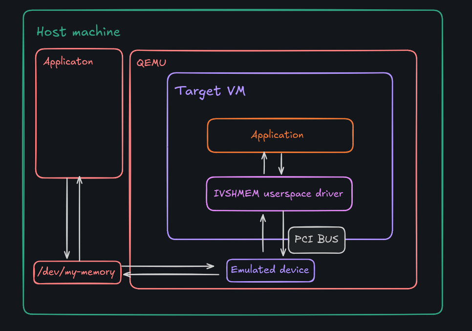
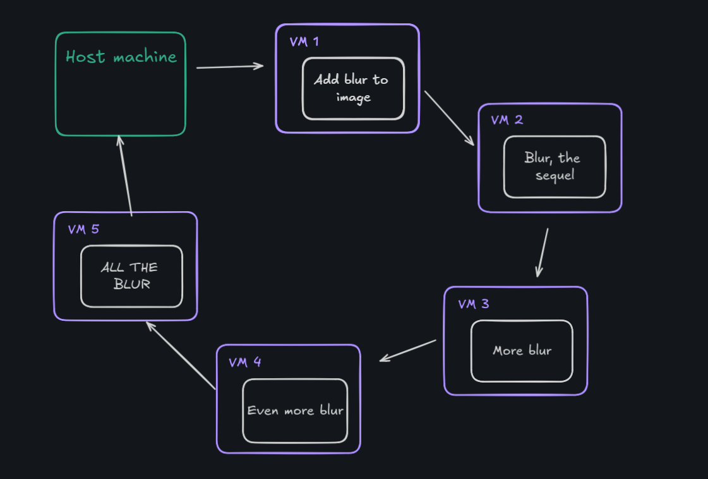
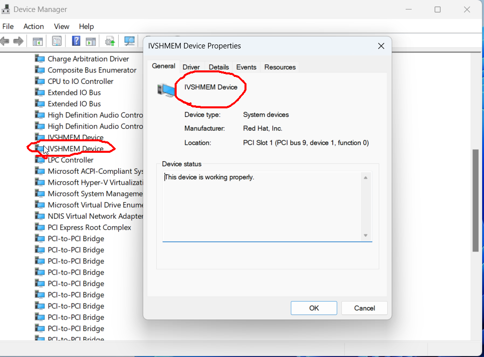

This post is about using [my library](https://pkg.go.dev/github.com/TypicalAM/ivshmem) to do something interesting

## Cool features of QEMU

On my main workstation, I have quite a peculiar setup when it comes to virtual machines. Namely, my Lenovo Legion 5 has two graphics cards - one from AMD (integrated), the other from NVIDIA (dedicated). When I boot up my Windows 11 virtual machine, the integrated card handles the host system and the dedicated card is passed through. GPU passthrough is a technology that allows the Linux kernel to directly present an internal PCI GPU to a virtual machine. The device acts as if it were directly driven by the VM, and the VM detects the PCI device as if it were physically connected. Since the default video viewer (a SPICE server) can be a bit sluggish, I use [LookingGlass](https://github.com/gnif/LookingGlass) to view the guest’s video stream on the host.

**Why does this matter?** It is precisely while looking through the code of LookingGlass I got to know a bit about something used to transfer the guest video frames to the host machine. It is called **IVSHMEM** or **Inter-VM shared memory device**. I've since created a library to leverage this feature, which I'm excited to share with you.

## Technical Overview of IVSHMEM

According to the [device specs](https://www.qemu.org/docs/master/specs/ivshmem-spec.html):

> The Inter-VM shared memory device (ivshmem) is designed to share a memory region between multiple QEMU processes running different guests and the host. In order for all guests to be able to pick up the shared memory area, it is modeled by QEMU as a PCI device exposing said memory to the guest as a PCI BAR.

Here's a simplified visualisation:



Essentially, both the host and guest share access to the same memory region, which they can both use and modify. Memory transfer is much faster than disk or network transfers *(even in virtual NICs)*, making this technology valuable in some scenarios:

- **High-Speed Image Processing Pipelines** - Creating an image processing pipeline which has multiple VM's specialised for processing images in high speeds, you could create a ring of VM's each one processing an image and then sending it to the next guest through IVSHMEM:



- **Sending and processing big data streams**

## Building an example app

To build an example application using IVSHMEM, we need to set up both the host and the guest to interact with the shared memory region. Reffering to the *beautiful* diagram:

- **On the host**: QEMU exposes a `/dev/my-memory-xyz` file, we can connect to it somehow using the host machine to get the shared memory region
- **On the guest**: there is a PCI device on the machine which can give us access to the memory region. We have to figure out how to:
  1) find the appropriate PCI location
  2) ask the driver for the memory

**It just so happens that I created a library just for this purpose!** It's called [ivshmem](https://github.com/TypicalAM/ivshmem) (I wonder why) and supports both windows and linux guest machines. **Let's create a quick example with sending a huge file**

In this case we are going to be using **one host** (Fedora Workstation 40, the best distro there is) and **one guest** (Windows 11 Pro). We are going to be sending a **1GiB file** with a **64MiB IVSHMEM buffer**. In this example we are going to be using a simple shared memory device file for communication on the host, because of that we cannot have meaningful synchronisation primitives (for example by [using interrupts](https://www.qemu.org/docs/master/specs/ivshmem-spec.html)).

### Enabling support

First, enable ivshmem:
- If you are using `virt-manager` for your machines, edit the [XML config](https://libvirt.org/formatdomain.html#shared-memory-device)

```
<shmem name='my-little-shared-memory'>
  <model type='ivshmem-plain'/>
  <size unit='M'>64</size>
</shmem>
```

- If you are using raw `qemu` from the cmdline, add the following args

```
-device ivshmem-plain,memdev=ivshmem,bus=pcie.0 \
-object memory-backend-file,id=ivshmem,share=on,mem-path=/dev/shm/my-little-shared-memory,size=64M
```

Now you need to think about the **guest**. If you are using linux, skip this part - everything is ready to go. However, on windows you need to install the **IVSHMEM driver** - open up the machine and download the driver from [here](https://fedorapeople.org/groups/virt/virtio-win/direct-downloads/upstream-virtio/). To install the IVSHMEM driver you will need to go into the device manager and update the driver for the device “PCI standard RAM Controller” under the “System Devices” node. You should now be able to see this device in device manager as:



*Reminder: On linux everything works out of the box*

### Writing host code

Let's connect to the buffer from the host - create a `host.go` file:

```go
//go:build linux

package main

import (
	"log"
	"github.com/TypicalAM/ivshmem"
)

func main() {
	h, err := ivshmem.NewHost("/dev/shm/my-little-shared-memory")
	if err != nil {
		log.Fatalln("Failed to attach to shmem file:", err)
	}

	if err := h.Map(); err != nil {
		log.Fatalln("Failed to map memory from file:", err)
	}
	defer h.Unmap()

	log.Println("Shared mem size (in MB):", h.Size()/1024/1024)
	log.Println("Device path:", h.DevPath())
	copy(h.SharedMem(), "Hello from ze host!")
}
```

*You can experiment with the `ivshmem.Host` object via the [docs](https://pkg.go.dev/github.com/TypicalAM/ivshmem) or see the examples on [my github](https://github.com/TypicalAM/ivshmem).*

In this code, we map the shared memory into our address space, use it, and then unmap it. Running this example should produce the following output.

```sh
> go run host.go
2024/08/14 18:27:41 Shared mem size (in MB): 64
2024/08/14 18:27:41 Device path: /dev/shm/my-little-shared-memory
```

Now, our goal is to send a file using this memory buffer, but we don't have access to synchronisation in any way. In this case we can use a [ring buffer](https://en.wikipedia.org/wiki/Circular_buffer). We will use the first 16 bytes of our 64MiB buffer for saving the read and the write pointers, both 8 bytes. Let's create a basic circular buffer implementing a `io.Writer` interface:

```go
const headerSize = 16

type HostWriter struct {
	dev *ivshmem.Host
}

func (hw *HostWriter) Write(p []byte) (n int, err error) {
	shmem := hw.dev.SharedMem()
	readPtr := binary.BigEndian.Uint64(shmem[0:8])
	writePtr := binary.BigEndian.Uint64(shmem[8:16])

	var availableSpace uint64
	if readPtr <= writePtr {
		availableSpace = hw.dev.Size() - headerSize - writePtr + readPtr - 1
	} else {
		availableSpace = readPtr - writePtr - 1
	}

	for uint64(len(p)) > availableSpace {
		readPtr = binary.BigEndian.Uint64(shmem[0:8])
		if readPtr <= writePtr {
			availableSpace = hw.dev.Size() - headerSize - writePtr + readPtr - 1
		} else {
			availableSpace = readPtr - writePtr - 1
		}
	}

	if writePtr+uint64(len(p)) <= hw.dev.Size()-headerSize {
		// In one go
		copy(shmem[headerSize+writePtr:], p)
		writePtr += uint64(len(p))
	} else {
		// Split the write
		firstChunkLen := hw.dev.Size() - headerSize - writePtr
		copy(shmem[headerSize+writePtr:], p[:firstChunkLen])
		copy(shmem[headerSize:], p[firstChunkLen:])
		writePtr = uint64(len(p)) - firstChunkLen
	}

	binary.BigEndian.PutUint64(hw.dev.SharedMem()[8:16], writePtr) // Update the write ptr
	return len(p), nil
}
```

Now for the host code plan:

1) Map the memory (and defer unmapping)
2) Clear the entire memory buffer (to avoid trash, especially in our read/write pointers)
3) Read the full 1GiB file into a `[]byte`
4) Write it all to the circular buffer

and the code:

```go
func main() {
	...
	copy(h.SharedMem(), make([]byte, h.Size()))

	data, err := os.ReadFile("file")
	if err != nil {
		log.Fatalln("Failed to read large file:", err)
	}

	start := time.Now()
	hw := HostWriter{dev: h}
	const chunkSize = 1 * 1024 * 1024 // 1MiB
	total := 0
	for i := 0; i < len(data)/chunkSize; i++ {
		count, _ := hw.Write(data[i*chunkSize : i*chunkSize+chunkSize])
		total += count
	}

	log.Println("Wrote bytes:", total)
	log.Println("Took:", time.Since(start))
}
```

### Writing guest code

The guest code works on both Windows and Linux, as **the library use is OS-independent**. Let's connect to the IVSHMEM device using a new `guest.go` source file:

*Tip: you can actually edit it inside of the host machine by setting the `GOOS=windows` environment variable - no need to install anything on your pesky windows!* 

```go
package main

import (
	"log"
	"github.com/TypicalAM/ivshmem"
)

func main() {
	devs, err := ivshmem.ListDevices()
	if err != nil {
		log.Fatalln("Cannot list devices:", err)
	}
	log.Println(devs)

	g, err := ivshmem.NewGuest(devs[0])
	if err != nil {
		log.Fatalln("Cannot create guest:", err)
	}

	if err = g.Map(); err != nil {
		log.Fatalln("Cannot map memory:", err)
	}
	defer g.Unmap()

	log.Println("Selected IVSHMEM device:", g.Location())
	log.Println("Shared mem size (in MB):", g.Size()/1024/1024)
}
```

and the ring buffer reader using `io.Reader`, basically the same thing as host writer but the other way around:

```go
const headerSize = 16

type GuestReader struct {
	dev *ivshmem.Guest // IVSHMEM guest device
}

func (gr *GuestReader) Read(p []byte) (n int, err error) {
	shmem := gr.dev.SharedMem()
	readPtr := binary.BigEndian.Uint64(shmem[0:8])
	writePtr := binary.BigEndian.Uint64(shmem[8:16])

	for writePtr == readPtr || (writePtr > readPtr && uint64(len(p)) > writePtr-readPtr) || (writePtr < readPtr && uint64(len(p)) > (gr.dev.Size()-headerSize-readPtr+writePtr)) {
		writePtr = binary.BigEndian.Uint64(shmem[0:8])
	}

	if readPtr+uint64(len(p)) <= gr.dev.Size()-headerSize {
		// Read in one go
		copy(p, shmem[headerSize+readPtr:])
		readPtr += uint64(len(p))
	} else {
		// Split the read
		firstChunkLen := gr.dev.Size() - headerSize - readPtr
		copy(p, shmem[headerSize+readPtr:headerSize+readPtr+firstChunkLen])
		copy(p, shmem[headerSize:headerSize+uint64(len(p))-firstChunkLen])
		readPtr = uint64(len(p)) - firstChunkLen
	}

	binary.BigEndian.PutUint64(gr.dev.SharedMem()[0:8], readPtr) // Update the read pointer
	return len(p), nil
}
```

Finally, we’ll read the chunks from the buffer:

```go
func main() {
	...
	start := time.Now()
	gr := GuestReader{dev: g}
	const chunkSize = 1048576 // 1MiB
	scratch := make([]byte, chunkSize)
	total := 0
	for i := 0; i < 1024; i++ {
		count, _ := gr.Read(scratch)
		// Blur the output I guess?
		total += count
	}
	log.Println("Read bytes:", total)
	log.Println("Took:", time.Since(start))
}
```

We loop 1024 times because we read a 1GiB file in 1024 chunks, each one having 1MiB. To create a file with random data of size 1GiB on the host, run:

```sh
head -c 1GiB < /dev/random > file
```

Now power on the VM, run the host first and the guest right after that:

```sh
> go run host.go
2024/08/14 20:17:59 Shared mem size (in MB): 64
2024/08/14 20:17:59 Device path: /dev/shm/my-little-shared-memory
2024/08/14 20:18:09 Wrote bytes: 1073741824
2024/08/14 20:18:09 Took: 9.109433327s
```

```sh
> GOOS=windows go build -o ivshmem.exe guest.go
> mv ivshmem.exe ~/shared/win/
copied 'ivshmem.exe' -> '/home/adam/shared/win/ivshmem.exe'
removed 'ivshmem.exe'
> # You can also run it by hand, i just have an ssh server set up
> ssh vm-win11 "Desktop\Shared\ivshmem.exe"
2024/08/14 20:18:03 [PCI bus 4, device 1, function 0 PCI bus 9, device 1, function 0]
2024/08/14 20:18:03 Selected IVSHMEM device: PCI bus 4, device 1, function 0
2024/08/14 20:18:03 Shared mem size (in MB): 64
2024/08/14 20:18:08 Read bytes: 1073741824
2024/08/14 20:18:08 Took: 5.3062731s
```

### Results and limitations

We read `1073741824B == 1GiB` of data in around `5.3s` achieving a **transfer rate of `1.5Gbps`, pretty neat!** However this simple example has some limitations:
- **Write speed measurement** - The time recorded for writing data includes periods when the writer is waiting for the reader to catch up before continuing to write more data. This artificially inflates the time.
- **End-of-Stream Handling** - The writer should usually send a `io.EOF` at the end of the stream. This could be modelled in shared memory by:
	1) Having a series of bytes indicating an EOF
	2) Sending the size of the chunk before each sent chunk
- **Flushing changes** - You can `ivshmem.Guest.Sync()` or `ivshmem.Host.Sync()` to sync the data just in case it gets buffered. Refer to the [docs](https://pkg.go.dev/github.com/TypicalAM/ivshmem).
- **Lack of Interrupts** - When using interrupts with for example `ivshmem-server` we could probably achieve higher speeds because of not needing to use ring buffers.

While messing around and improving on this example I got speeds up to `4Gbps`, which is pretty impressive considering the fact that my RAM write speed (the theoretical maximum) clocks in at around `7.3Gbps` and we are performing caveman synchronisation strategies.

## Epilogue

Overall I'm very proud of myself, since this is the first time I've actually created a library instead of a standalone app. I learned a lot about virtualization systems, how PCI works and how to use `.dll` files easily on windows. If you want to want to see how to use a driver inside of a `go` application you can visit [the guest code](https://github.com/TypicalAM/ivshmem/blob/main/guest_windows.go#L94)! I hope you got to know something more by reading this too! 

*Cover photo by Jeremy Waterhouse on [pexels](https://www.pexels.com/photo/green-and-black-circuit-board-3665442)*
