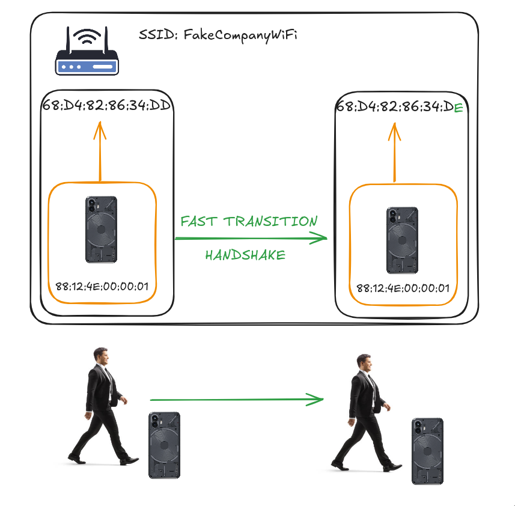

## Introduction

**[Last time](https://blog.piaseczny.dev/posts/wifi-intro/) we talked about basic attacks on wireless networks and their implications.** If you didn't read that one, I suggest you do because now we are going to be talking about a different type of attacks, namely ones that do not require an active client to be connected to the network. Those attacks are aptly called **clientless attacks!**

> DISCLAIMER: PLEASE DO NOT ATTACK NETWORKS THAT ARE NOT YOURS. PLEASE.

## Recap

The last time we atacked our example theoretical work network using `WPA2PSK` we had the following flow:

- Listen for Wi-Fi channel announcements on the network (Control Beacon frames)
- Switch your network card to follow the specific channel (to catch more packets)
- **Disconnect your boss from the network somehow**, either physically or spoofing a deauthentication packet (almost all devices reconnect automatically)
- **Catch the 4-way `EAPOL` handshake** messages, gather both the `PTK` and the `GTK`
- **Decrypt all of the traffic and wreak havoc**

This approach allows us to decrypt all group traffic, since the GTK is shared among all the connected clients for at least the duration of the client connection (the AP can initiate a key rotation later). It also allows us to catch and decrypt all the LAN traffic directed to and from this client, **this includes the default gateway - our bridge to the wide area network (WAN)**. But what if do not now the password of the network? We cannot construct the `PMK`, validate the `EAPOL` through message integrity checks (`MIC`) in the 4-way exchange and we are also miserable in any other way possible. This begs the question - **How can we recover a password?**

## PMKID

One access point usually does not have radio coverage that is good enough for bigger spaces, therefore we can join together multiple access points to increase the available coverage. This moves our network conceptually from what is called a **Basic Service Set (`BSS`)** to an **Exteded Service Set (`ESS`)**. `ESS` allows us to have multiple access point devices, each with a different hardware address (`ESSID`) but all with the same readable network name (`SSID`). Your phone identifies traffic that comes from different AP nodes of an `ESS` and combines them into a single logical network. Some APs that were manufactured before `802.11ax` was widely supported allowed to create an `ESS` where:

- The first AP was on the 2.4GHz band and
- The second one was on the 5GHz band (`802.11ac`)

This allowed for unified network addresing and the same network IDs for devices on both radio bands.

### Roaming

To understand the `PMKID` attack we first need to understand what roaming is when it comes to Wi-Fi networks. This basically boils down to the idea that when people physically move through a building they should be connected to the AP with the strongest radio signal. **So when signal strength starts to dwindle down a client starts searching for nearby APs within the same `ESS` by sending a `Probe Request` frame, then the client connects to another, closer AP.** But doing a full 4-way handshake is too slow, that's why we are using a new one called the Fast Transition handshake (FT). The roaming process can be visually demonstrated as follows:



In such wide networks we usually utilize different `PMKs` so the APs track which PMK was used for a client connection using a special attribute called `PMKID`. The PMKID is included in the first message of the initial 4-way EAPOL exchange and is constructed as follows:

> PMKID = HMAC-SHA1(PMK, "PMK Name" + MAC_AP + MAC_Client)

- "PMK Name" - A fixed, standardized string used in the HMAC function to ensure compatibility across devices.
- MAC_AP - The MAC address of the access point.
- MAC_Client - The MAC address of the client attempting to connect.

You might notice that we basically know all the other components of the `PMKID` apart from the `PMK`, even if we don't know the password. You might also remember that **the first message is sent to the client before the client confirms that they know the password through the `MIC`. This means that if we have the `PMKID` we can try to brute force the `PMK`, which in turn gives us the password to the network!** Unfortunately the inclusion of the client and access point hardware addresses prevents us from precomputing [rainbow tables](https://en.wikipedia.org/wiki/Rainbow_table), so we have to hash directly.

### Performing an attack

We can demo an attack as follows:

- Perform a fake client connection to extract the `PMKID` using `hcxdumptool`
- Use `hcxpcaptool` to extract a `hc22000` file from a packet capture
- Use `hashcat` mode 22000 with a wordlist to extract the password

[ZerBea](https://github.com/ZerBea) created `hcxtools`, which is the toolkit that we are using for all `PMKID`-related attacks. This person collaborated with the `hashcat` team to bring us the [amazing 22000 mode](https://hashcat.net/wiki/doku.php?id=cracking_wpawpa2) which allows for efficient `PMK` cracking. Let's put our trusty NIC into monitor mode once again:

```sh
sudo iw phy phy1 interface add mon0 type monitor
sudo iw dev wlp5s0f3u2 del # name of your wireless iface
sudo ip link set mon0 up
```

Perform the fake client connection:

```sh
sudo hcxdumptool -i mon0 --enable_status 5 -o dump.pcapng
```

After noticing some `PMKID` attempts we can then convert the dump file into a `hc22000` format, which `hashcat` can take as an input:

```sh
hcxpcaptool -o hash.hc22000 dump.pcapng
```

Then we can just use `hashcat` to recover the password!

```sh
hashcat -m 22000 hash.hc22000 wordlist.txt
```

On my machine this mode achieves around 200kH/s by using the NVIDIA GPU, so it's not that bad. **Now if the password is relatively weak, it can be brute forced!**

## Finishing up

I hope you learned something new about wireless security by reading this article. This research was used for my network analyzer and sniffer which supports extracting `hc22000` files via capturing a client connection. The project is called [Yarilo](https://github.com/TypicalAM/Yarilo/) so you should check it out and maybe drop a star if you like it!

**And most importantly: don't get sniffed!**


