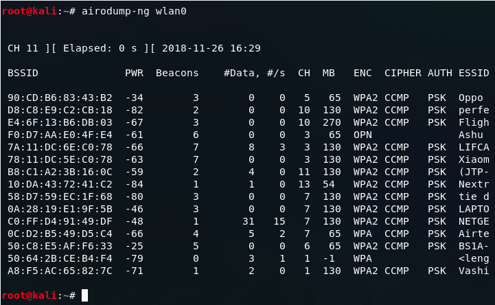
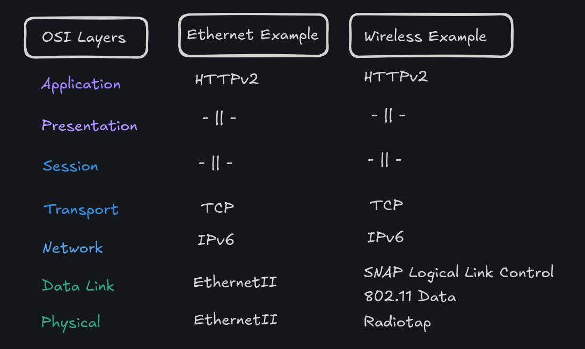
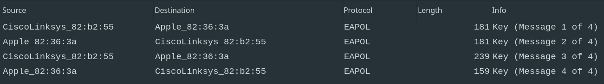
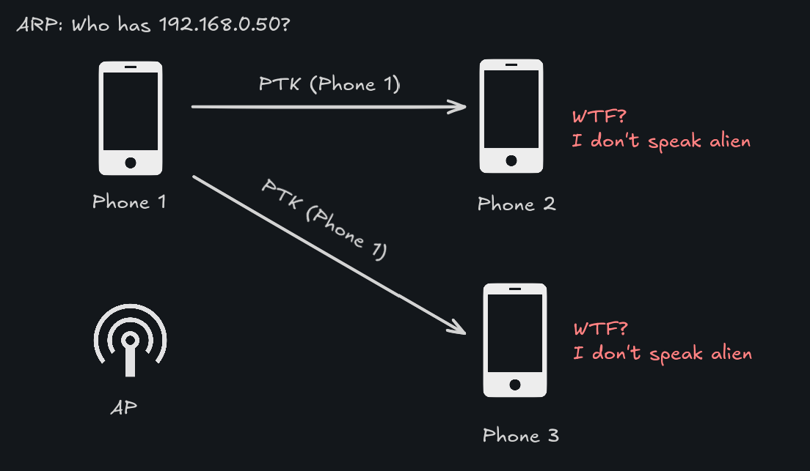
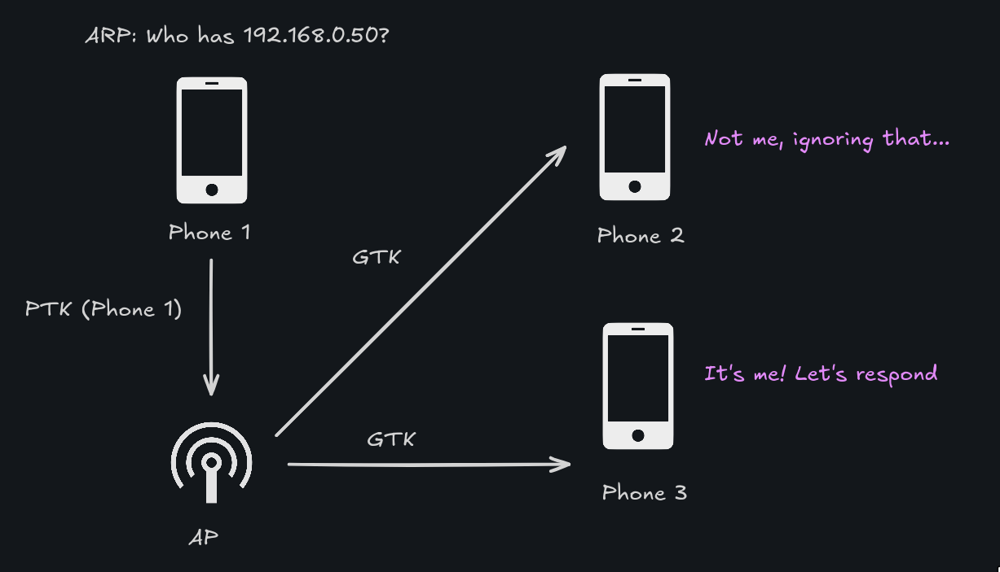

## Introduction

A lot of the hackers that I got to know in [PUT Request](https://putrequest.put.poznan.pl/) started their journey **hacking wifi networks.** Using the [aircrack-ng](https://www.aircrack-ng.org/) suite is very friendly to script kiddies so it suddenly becomes really easy to call yourself a `cr4zy h4x0r`. Never used it? Just **look at this** juicy `airodump` screenshot and **imagine that you are 12 years old:**



Ever wondered how these tools worked? **I did, so for my [engineering thesis](https://github.com/TypicalAM/Yarilo/) I decided to build a better `aircrack` from scratch**. Would you like to build something like that too? If so, maybe this post will prove somewhat helpful at understanding the high-level concepts. Let's sniff some wifi networks!

> DISCLAIMER: PLEASE DO NOT DECRYPT NETWORKS THAT ARE NOT YOURS. PLEASE

## Setting yourself up for success

Our end goal is being able to view data payloads from other users in a basic, secured home wireless network (`WPA2-PSK`). This post is more on the theoretical side, although you can try doing this at home and exploring some of the things that I will be talking about using a *monitor-enabled* wireless network card (like my `TP-Link Archer T3U Nano`). Enable `monitor mode` on the card using:

```sh
sudo iw phy phy1 interface add mon0 type monitor
sudo iw dev wlp5s0f3u2 del # name of your wireless iface
sudo ip link set mon0 up
```

Then you can use [wireshark](https://www.wireshark.org/) on `mon0` to capture traffic from the networks around you.

## Something something network card

**Wi-Fi devices have to communicate *somehow* and if it's not telekineses it's probably radio communication.** Radio means that even if you are not the intended recipient of the message you might be able to catch something by, well, just listening to the radio signals. That is what `monitor` mode is on, you basically tell your network interface card to behave like my girlfriend when I bring takeaway food home:


**Just like my girlfriend** the network card takes in the packets regardless of their intended destination. **Wait, what is this weird data format?**. Instead of the usual `EthernetII` packets on the data-link and physical layer we can see some new stuff. Namely:
- [Radiotap](https://www.radiotap.org/) for the physical layer information - your network card basically gives you an additional layer of physical information while sniffing, like `RSSI` (Received Signal Strength Indicator) and a radio noise indicator
- [802.11](https://www3.nd.edu/~mhaenggi/NET/wireless/802.11b/Data%20Link%20Layer.htm) for the data link layer, there are basically three main types of frames here:
  - **Management** frames - Allowing nodes to join/leave the network, authentication, association, etc.
  - **Data** frames – Carrying data from higher layers
  - **Control** frames - Acknowledging the delivery of data frames and clearing the medium for transmission



> Fun fact: Did you know that Wi-Fi, Bluetooth and microwaves use the 2.4GHz frequency? Have you tried sending a UDP packet to your microwave yet? 

## Authentication in wireless networks

Adam, why this long intro, why do I care? While looking at the packets in wireshark (or thinking about them) you might have noticed that they are, most likely, encrypted. In our example case, we are using `WPA2PSK` - what does that mean?
- `WPA2` means that we are using the second iteration of the "Robust Security Network" standard - Wi-Fi Protected Access 2
- `PSK` means Pre-Shared-Key, so all users have access to the same key which allows authenticating into the network.
- Most `WPA2` prefer using an [AES](https://pl.wikipedia.org/wiki/Advanced_Encryption_Standard)-based block encryption cipher - `AES-CCM` - Counter Mode with Cipher Block Chaining Message Authentication Code - **I know the letters don't match, don't ask**

Since we are using `AES`, we are using a session key for encryption which is obtained using the process of authentication. This key must somehow be related to:
- The PSK, meaning basically the password to the network
- Some random numbers generated by the client and the access point (like in [RSA](https://en.wikipedia.org/wiki/RSA_(cryptosystem)))

So let's get going!

## EAPOL keys and catching them

Personal wireless networks use `EAPOL` (Extensible Authentication Protocol over LAN) 4-way handshake for authentication since the 802.11x standard amendment. Those packets can be quite tricky to come by randomly, so if you're wiresharking with me you can input the filter string `eapol` to get the desired packets. Then just disconnect and reconnect your device from a network and you should see four messages along those lines:



The session key used to encrypt **unicast** traffic is called the Pairwise Transient Key or `PTK`. Pairwise because the client and the access point are a cute pair! The actual formula of creating this key is quite scary but we are going to break it down:

> PTK = PRF (PMK + Anonce + SNonce + Mac (AA)+ Mac (SA))

Now what do we know:
- PTK - Pairwise Transient Key - **our holy grail** - the session encryption key
- PRF - Pseudo random function known by both parties
- PMK - Pairwise **Master** Key - **This is the wifi password!**, in `WPA2PSK` `PSK == PMK` is true
- Anonce - Random number generated by the access point - **sent in the 1st EAPOL key handshake!**
- Snonce - Random number generated by the client - **sent in the 2nd EAPOL key handshake!**
- MAC (AA) - Hardware address of the access point
- MAC (SA) - Hardware address of the client

Now we can see that if we **capture the first two EAPOL messages, we can derive the encryption key!**, provided that we had the password to the network to begin with. So knowing the password of the network and capturing the moment a client connects allows us to ***easily* decrypt the *unicast* traffic of the client**. You can do this in wireshark using [this link](https://wiki.wireshark.org/HowToDecrypt802.11). But wait Adam! We just now needed only two `EAPOL` messages, what about the rest??? 

### Group traffic

Think about the following scenario, we want to send an `ARP` packet to know who has the `192.168.0.50` IP address. This packet is sent to all clients of the network, so we use the broadcast MAC address (`ff:ff:ff:ff:ff:ff`). We don't know what encryption keys other people on the network use, so we can't send them data that they can decrypt, right?



In real life this scenario is resolved like this -
- **We introduce another key - Group Temporal Key (`GTK`)** only for multicast and broadcast traffic and **only for use by the access point**
- The access point acts like a broadcast station for other clients
  - Receiving broadcast messages sent by the client
  - Decrypting them with the pairwise key and encrypting them with the group key
  - **Broadcasting them to all clients, who use the `GTK` and get underlying `ARP` packet**



So... new key huh? How do we get it? **Ah, right, more EAPOL messages**. The **third** EAPOL message should have a special payload: a fresh new `GTK` key encrypted with your `PTK`, so that only you can access it. Once we get that everything is fair game, **we can decrypt both unicast traffic and group traffic with our `PTK` and `GTK`. Yipee!**

>If you're wondering, the last `EAPOL` message just makes sure that the encryption keys are installed on the target and we can begin a secure communication session

### Rekeying

Another thing you might notice, is that our new group key might work on this network, **even if we are not connected anymore**. To prevent sniffing with your `GTK` after you disconnected 802.11x introduces a process called "Group Rekeying" or "Group Key Rotation". It means that if some conditions are met, the access point can initiate a rotation of the group key to a new, totally random `GTK`. This information is broadcast using another `EAPOL` handshake - **The 2-way group handshake**. This handshake is **encrypted using your pairwise key** to keep outsiders from catching it and contains the new group key. Usually you can configure your router to change the group key based on some factors like:
- **Timing** - rekeying after an interval (say, 5 minutes)
- **Association change** - rekeying after a device connects or disconnects from a network

**Both of these are valid protection mechanisms and you should turn them on so that you will not get sniffed!**

## Attack vector implications - Layer 2 attacks

**Why is using personal networks in an enterprise environment stupid, apart from the obvious naming?** Let's say that you work in a small company, on-site - you hate the commute and you love breaking the law. Your boss uses the same wireless network as you, `WPA2PSK`, and you know the password. You could then:
- Listen for WiFi channel announcements on the network (Control Beacon frames)
- Switch your network card to follow the specific channel (to catch more packets)
- **Disconnect your boss from the network somehow**, either physically or spoofing a deauthentication packet (almost all devices reconnect automatically)
- **Catch the 4-way `EAPOL` handshake** messages, gather both the `PTK` and the `GTK`
- **Decrypt all of the traffic and wreak havoc**

> REMINDER: DO NOT DO THIS IN REAL LIFE

### How WPA enterprise solves this

Setting up a `WPA2` or `WPA3` enterprise network is much harder than setting up a home one (duh). At the end of the day, they still use `AES-CCM` for encryption, **the difference is getting the session key.** In enterprise-level networks, the **access point isn't the one authenticating you.** We have another server for that (RADIUS), which is *hopefully* connected **OVER THE WIRE** to the access point, making it much harder to catch session keys. Also, **every client authenticates using a different set of credentials**, making it impossible to sniff your bosses traffic with only your certificate.

## Finishing up

**I hope you learned something about wireless networks today! Let's recap the key points:**
- `WPA2` uses `EAPOL` messages for authentication, if they are intercepted it's not fun
- There are two session keys: a pairwise one and a group one
- Configure rekeying on your router (if you can)
- Have a strong password! Bruteforcing the key is very unfeasible, unless your password is `12345678` of course 
- Basic wireless networks are a tad bit more complicated than ethernet ones

**If you want to build a traffic decrypter yourself, here are the things you would need:**
- Packet sniffer library (using raw `libpcap` is exponentially harder) - I used [libtins (C++)](http://libtins.github.io/)
- Good reading skills, patience and the [802.11 standard](https://www.candelatech.com/downloads/802.11-2016.pdf)
- Monitor-capable network card - `TP-Link Archer T3U Nano` is very nice
- `AES-CCMP` magic, like the one [seen here](https://github.com/TypicalAM/Yarilo/blob/cc84d434fb63e57fe868258e3fcdf30a0332cd3f/backend/src/group_decrypter.cpp#L57), also `CCM` mode is loosely based on `CTR`, so the order of the messages matters ;)))))

**And most importantly: don't get sniffed!**


*Above photo taken from the genius `libpcap` introduction from Martin Casado: http://yuba.stanford.edu/~casado/pcap/section1.html*

*Cover photo by Photo Source Kaboompics.com: https://www.pexels.com/photo/close-up-of-dog-nose-5420750/*
