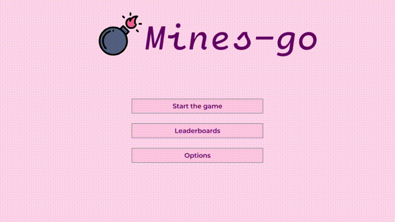
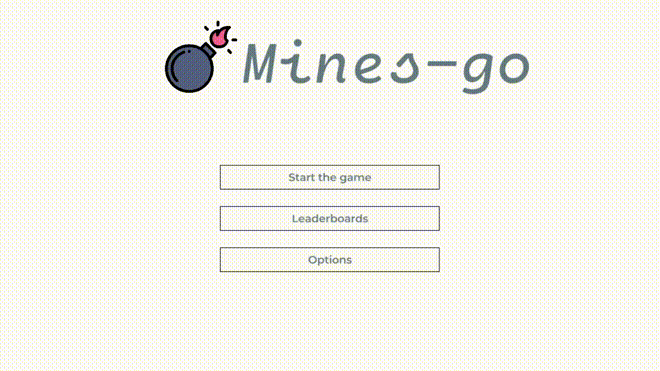

[mines](https://github.com/TypicalAM/mines) is a cool GUI game of minesweepeer developed in `raylib-go`. It has a sleek interface, changeable themes and an intuitive quick-select for the lazy ones.

## Features

- Play minesweeper! (obviously)
- Create your own board configurations
- Use and create custom themes!
- Make it onto the leaderboard
- Use a PS3 controller to play!

## Why make it?

[raylib](https://www.raylib.com/) just seemeed very interesting for me and I wanted to try it. I once locked out myself in linux (broke the bootloader) and was _forced_ to play minesweeper since the only game I usually played was only on windows... None of the available minesweeper games on linux have two things:

- a nice interface
- an intuitive quick-select functionality

**So I thought I would do both**

## Showoff

### Basic usage

### Settings change

## Where can I find it?

Just download the latest binary from the [releases page](https://github.com/TypicalAM/mines/releases/)!

#### Sidenote

*If you find technical problems interesting I also have an article about creating the cross-compilation CI pipeline for this project, you can read it [here](/posts/cgo-cross).*
