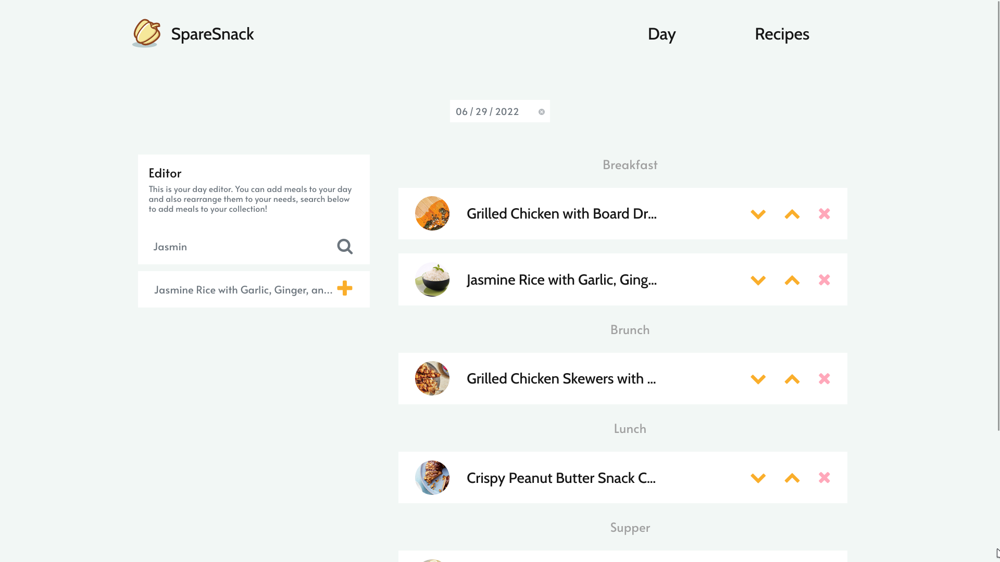
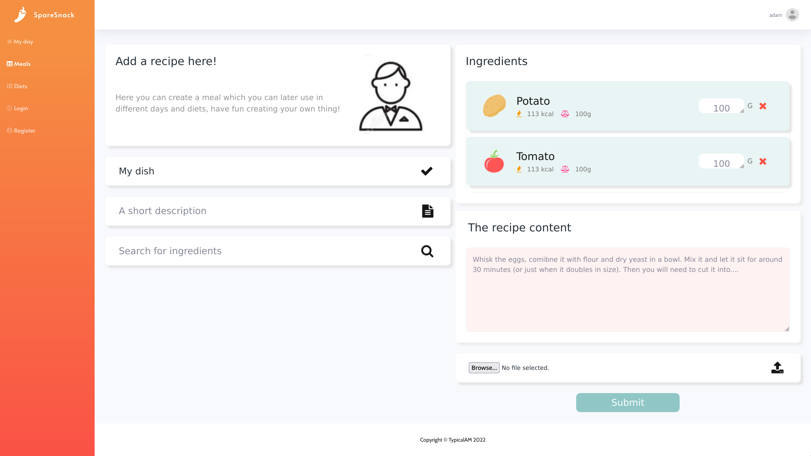

**[SpareSnack](https://github.com/TypicalAM/SpareSnack) is a diet management platform** initially made for me and my girlfriend (busy people who like consistency). It organically grew into a platform for sharing diets between users. Counting your calories can prove to be very difficult and sometimes we just want to eat the thing that we ate a week ago.

## Features

- Your dining plans are categorized into `days`, which are comprised of `meals`, which are themselves comprised of `recipes`
- You can plan your `days` forward in time
- Days can be `cloned` to eat something from a previous date
- Multiple `days` or time ranges can be made into reusable `Diets` which can be shared with other users, or just with yourself.

## Why even make it?

I was looking for something which can generate my diet plan dynamically based on the things that I like. I also wanted to share those plans with my girlfriend and be able to stay consistent with my diet, this sprouted an idea for a diet sharing system. The initial idea grew in complexity (that's also why automatic diet generation doesn't work) and became this behemoth of a project.

This is a rewrite of the old version in Django (also in Django), it looks and performs better. I also learned a lot of programming stuff with the first version and implemented some tricks (like tests lol) in this one. Enjoy.

## Showoff

### Your day

### Creating a recipe

## Where can I find it?

**I'm working on taking the project live at [snack.piaseczny.dev](https://snack.piaseczny.dev)**! For now, you can check out the code on [GitHub](https://github.com/TypicalAM/SpareSnack) and build it yourself. Happy dieting!
